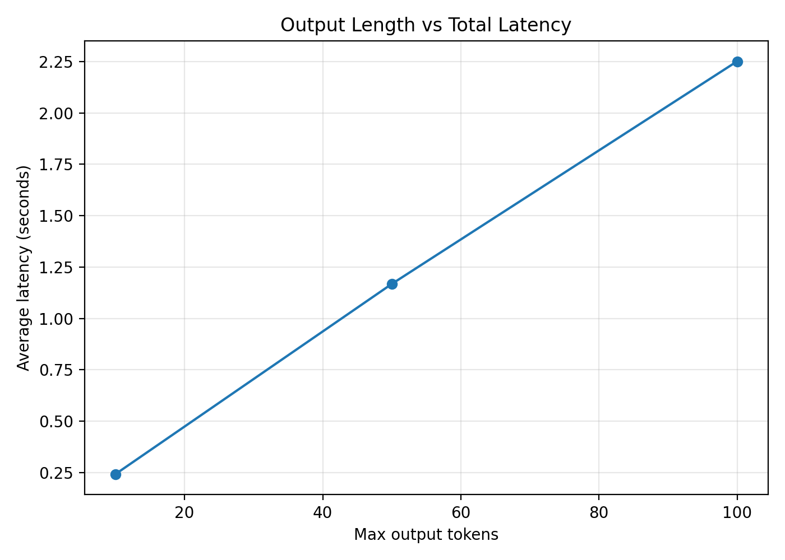
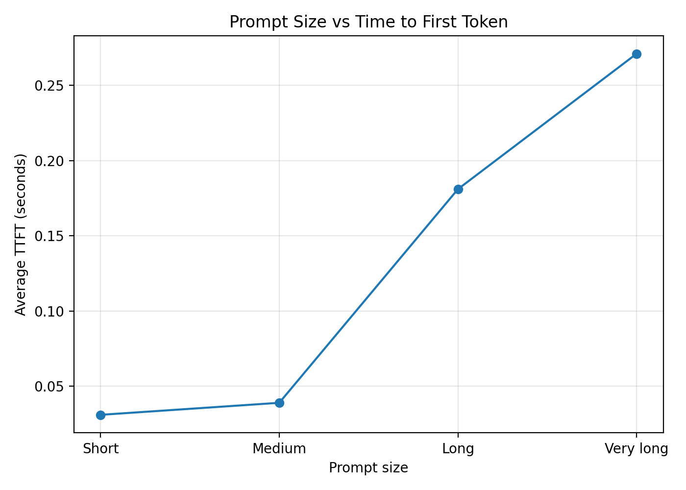
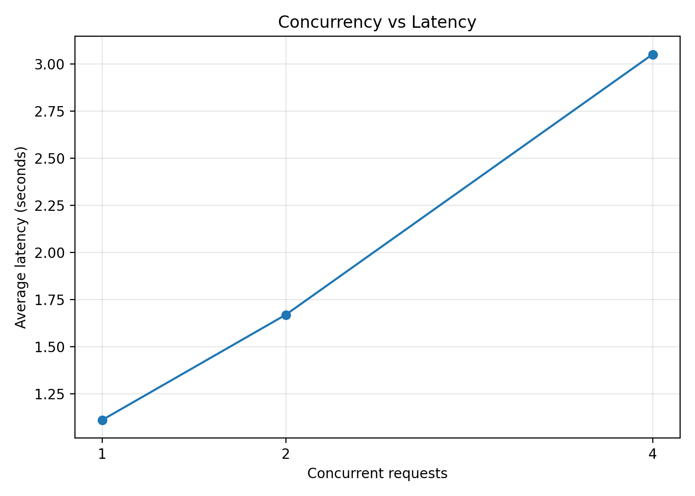
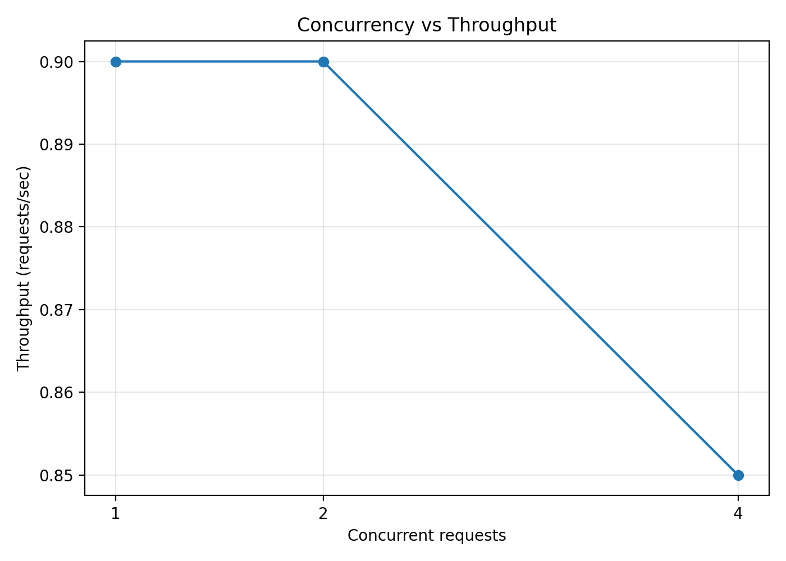

# LLM Inference Performance Benchmark

A reproducible study of local LLM serving performance: what drives **time to first token (TTFT)**, end-to-end latency, generation speed, and request throughput—and where a single-node CPU setup reaches its limit.

> **Portfolio case:** I designed the experiment matrix, implemented a streaming benchmark client, collected raw observations, visualized the results, and translated them into serving and capacity-planning implications.

## Results at a glance

| Experiment | Published result | Operational interpretation |
|---|---|---|
| Output length | Average latency rose from **0.243 s at 10 tokens** to **2.251 s at 100 tokens**; TTFT stayed near 0.03 s | Output limits are a direct latency and compute-cost control |
| Prompt size | Average TTFT rose from **0.031 s (short)** to **0.271 s (very long)** | Large context increases prefill work before the user sees a token |
| Concurrency | At 1→4 concurrent requests, average latency rose **1.112→3.052 s**, while throughput changed **0.90→0.85 req/s** | This CPU configuration was already compute-bound; more in-flight work created queueing, not capacity |
| CPU threads | At 1→4 threads, generation speed rose **19.39→42.16 tok/s** and average latency fell **5.130→2.374 s** | Runtime configuration materially affects the same model on the same host |

These are observations from one local test environment, not universal model-performance claims.

## Visual result gallery

| Output length affects decode latency | Prompt size affects TTFT |
|---|---|
|  |  |

| Concurrency increases latency | Throughput does not improve |
|---|---|
|  |  |

## Production-oriented interpretation

The benchmark separates two inference phases that require different controls:

- **Prefill:** prompt processing before the first generated token. Track with TTFT; manage through context limits, prompt design, caching, and model/runtime choice.
- **Decode:** autoregressive output generation. Track with tokens/s and total latency; manage through output limits, quantization, hardware, batching, and serving configuration.

The concurrency result is the clearest capacity signal in this dataset: latency degraded without a throughput gain. In a production service, that would justify an explicit concurrency limit or queue, followed by tests of batching, replicas, and accelerated hardware before increasing admitted load.

### From averages to service-level metrics

Means explain trends, but production readiness depends on tail behavior. `analyze_results.py` derives **P50/P95/P99** from the raw observations already committed to this repository:

```bash
python analyze_results.py
```

The generated table is stored in [`results/percentiles.csv`](results/percentiles.csv). It covers baseline, output-length, and prompt-size runs. The concurrency CSV contains only published aggregates, so concurrency percentiles are intentionally not inferred. A future load test should save one row per request before tail latency is compared across configurations.

## Benchmark design

### Test environment

| Layer | Configuration |
|---|---|
| Model | Qwen2.5-0.5B-Instruct |
| Format / quantization | GGUF / Q4_K_M |
| Runtime | llama.cpp via llama-cpp-python |
| Host | Intel MacBook Pro, quad-core i5 2.3 GHz, 8 GB RAM, Hyper-Threading enabled |
| Serving | Local HTTP API on `127.0.0.1:8000` |

### Metrics

- **TTFT:** request start to first streamed content token.
- **Total latency:** request start to completed response.
- **Generation speed:** generated tokens divided by time after the first token.
- **Throughput:** completed requests per second under the tested load.

Streaming was used for TTFT. Generated tokens were counted through the llama.cpp tokenizer endpoint rather than approximated from words. Raw observations are versioned in [`results/`](results/).

### Experiment matrix

| Experiment | Changed variable | Held constant / sample |
|---|---|---|
| Baseline | None | 30 sequential requests, `max_tokens=100` |
| Output length | `max_tokens`: 10, 50, 100 | Same prompt, 30 requests per setting |
| Prompt size | Short, medium, long, very long | `max_tokens=50`, 20 requests per setting |
| Concurrency | 1, 2, 4 requests | Same local inference server |
| CPU threads | 1, 2, 4 | Same model and host |

## Detailed findings

### 1. Output length: decode dominates total latency

| Max output tokens | Average TTFT | Average latency | Average speed |
|---:|---:|---:|---:|
| 10 | 0.030 s | 0.243 s | 47.06 tok/s |
| 50 | 0.027 s | 1.168 s | 43.84 tok/s |
| 100 | 0.027 s | 2.251 s | 43.33 tok/s |

Latency increased approximately linearly while TTFT remained stable. Generation speed also stabilized for longer outputs.

### 2. Prompt size: prefill drives TTFT

| Prompt size | Average TTFT | Average latency |
|---|---:|---:|
| Short | 0.031 s | 1.160 s |
| Medium | 0.039 s | 1.172 s |
| Long | 0.181 s | 1.318 s |
| Very long | 0.271 s | 1.508 s |

Larger prompts increased time before generation began, demonstrating the distinction between input processing and output decoding.

### 3. Concurrency: queueing without additional capacity

| Concurrent requests | Average latency | Throughput |
|---:|---:|---:|
| 1 | 1.112 s | 0.90 req/s |
| 2 | 1.670 s | 0.90 req/s |
| 4 | 3.052 s | 0.85 req/s |

The server reached a compute-capacity bottleneck: additional concurrent requests increased waiting time instead of completed work per second.

### 4. CPU threads: configuration matters

| CPU threads | Average TTFT | Average latency | Generation speed |
|---:|---:|---:|---:|
| 1 | 0.075 s | 5.130 s | 19.39 tok/s |
| 2 | 0.052 s | 3.037 s | 32.83 tok/s |
| 4 | 0.045 s | 2.374 s | 42.16 tok/s |

The largest gain appeared from one to two threads, with further improvement at four threads—the number of physical CPU cores reported by the host.

## Limitations

- Results describe a small quantized model on one Intel CPU host and do not estimate production capacity.
- Prompt groups use character-based categories rather than fixed input-token buckets.
- Runs do not separate warm-up/cold-start observations; the percentile table exposes their effect but does not relabel them.
- The concurrency dataset stores aggregate values only, so its variance and tail latency cannot be recovered.
- No production batching, autoscaling, request queue, timeout/error-rate tracking, memory telemetry, or sustained-load soak test was used.
- The experiments isolate performance behavior; they do not compare model quality.

## Next measurement plan

The next iteration should turn the same experiment structure into a configuration comparison rather than merely add more charts:

1. Define fixed input/output token buckets and a warm-up policy.
2. Save one row per request with a configuration ID, timestamps, status, TTFT, latency, and token counts.
3. Compare P50/P95/P99 latency, throughput, and error rate at each concurrency level.
4. Add memory/CPU/GPU utilization and a sustained-load run.
5. Apply explicit acceptance thresholds (for example, a TTFT SLO and maximum error rate) before selecting a serving configuration.

Candidate comparisons include CPU versus GPU, quantization levels, batch settings, and multiple replicas. They are a measurement roadmap, not results claimed by this repository.

## Run locally

```bash
python -m venv .venv
source .venv/bin/activate
pip install -r requirements.txt
```

Start a llama.cpp-compatible server with the model on port `8000`, then run:

```bash
python benchmark.py
python token_benchmark.py
python prompt_benchmark.py
python charts.py
python analyze_results.py
```

Raw measurements live in [`results/`](results/); generated visualizations live in [`charts/`](charts/).

## Repository structure

```text
.
├── benchmark.py           # sequential baseline with streaming TTFT
├── token_benchmark.py     # output-length experiment
├── prompt_benchmark.py    # prompt-size experiment
├── analyze_results.py     # P50/P95/P99 from committed raw observations
├── charts.py              # result visualizations
├── results/               # raw and derived CSV results
└── charts/                # published plots
```
